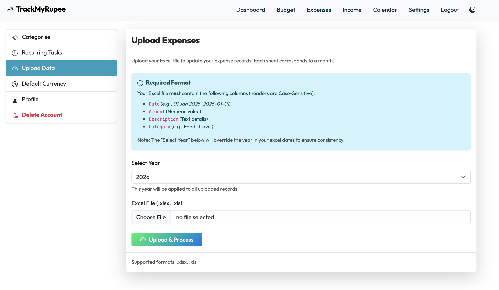
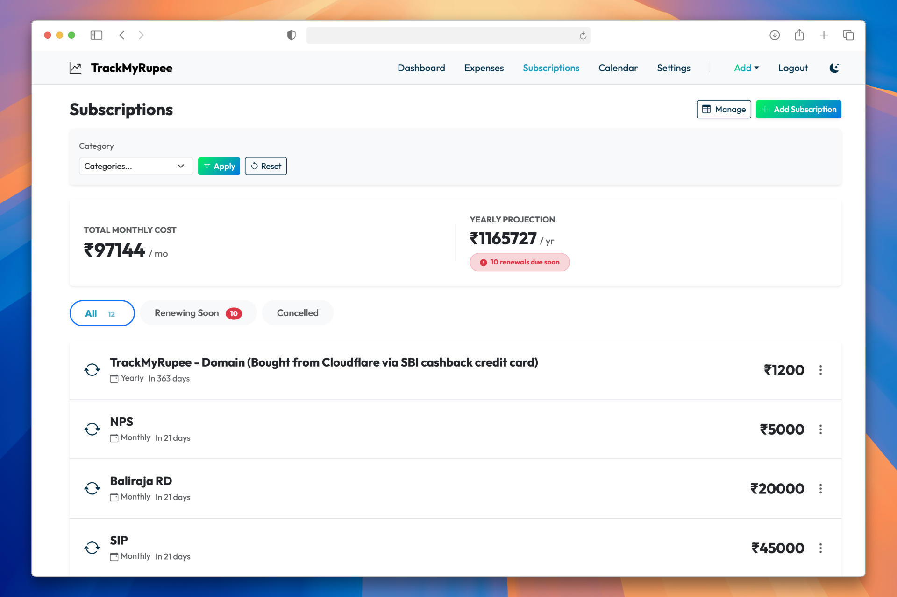

## Standout Features

### 1. Interactive Budget Dashboard
Visualize your monthly spending against your budget goals. Get instant alerts when you're nearing your limits.

### 2. Smart Excel Import
Bulk upload your expenses with intelligence. The system automatically enforces the selected year and handles various date formats.

### 3. Comprehensive Filtering
Slice and dice your financial data. Filter by **Year**, **Month**, **Category**, and **Date Range** to get the insights you need.

### 4. Recurring Transactions
Set it and forget it. Automate your regular income and expenses (like rent or subscriptions) so you never miss an entry.

### 5. Category Management & Limits
Create custom categories and set monthly spending limits. The dashboard visualizes your progress against these limits.

### 6. Multi-Currency Support
Work with your preferred currency. Update your profile settings to display your local currency symbol across the app.

### 7. Smart Category Prediction 🧠
Typing descriptions manually? Let the app do the work.
- **Personalized Learning**: Recognizes your custom habits (e.g., "Momos" → "Street Food") from your history.
- **Rule-Based Instant Match**: Instantly detects common terms like "Uber", "Netflix", "Zomato", etc.
- **Generative AI (Optional)**: Connect Google Gemini AI for advanced context-aware categorization.

### 8. Smart Notifications & Email Reminders 🔔
Stay on top of your bills with a multi-channel notification system:
- **In-App Notifications**: Get alerts for upcoming payments directly in the dashboard.
- **Web Push Notifications**: Receive timely reminders on your device (supports both Desktop and Mobile).
- **Consolidated Email Summaries**: Get a single daily email listing all recurring payments due in 3 days (Exclusive to **Plus** and **Pro** users).
- **Auto-Cleanup**: Old notifications are automatically removed after 90 days to keep your list clean.

### 9. Loan Management with EMI Calculator 💰
Plan before you borrow. Full debt lifecycle management:
- **EMI Preview**: Calculate your monthly EMI before adding a loan (principal × interest rate × duration).
- **Multiple Loans**: Track home, car, personal, education, and business loans simultaneously.
- **Floating Interest Rates**: Update rates anytime as your loan terms change.
- **Amortization Schedule**: Visual breakdown of principal vs interest for each payment.
- **Repayment Tracking**: Log actual payments and monitor remaining principal and interest paid.

### 10. Smart Budgets & Spending Limits 📊
Take control of your spending patterns:
- **Category Budgets**: Set monthly spending limits for each category (Food, Entertainment, etc.).
- **Real-Time Alerts**: Dashboard shows progress bars and alerts when approaching limits.
- **Budget Variance**: Compare actual vs budgeted spending to optimize your planning.
- **Flexible Management**: Update budgets anytime as your lifestyle changes.

### 11. Double-Entry Ledger System 🔐
Bank-grade accounting for personal finances:
- **Balanced Transactions**: Every transaction is recorded twice to ensure integrity (debit/credit).
- **Auto-Reconciliation**: System detects and flags discrepancies in real-time.
- **Reconciliation Reports**: Monthly reports showing your account balances vs app records.
- **Audit Trail**: Complete history of all transactions with optional notes and attachments.

### 12. Year in Review & Monthly Reports 📈
Automated financial storytelling:
- **Annual Summary**: Comprehensive wrap-up of your year—total spent, saved, invested, and goals hit.
- **Monthly Email Summaries**: Automated reports delivered to your inbox showing key metrics.
- **Spending Trends**: Month-over-month analysis highlighting where your money goes.
- **Goal Progress**: Visual milestones and celebration badges when you hit savings targets.