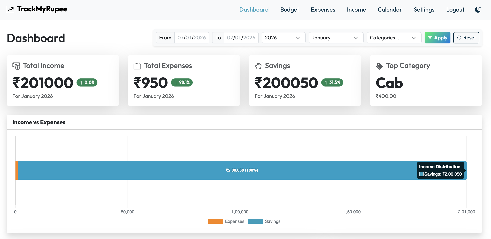
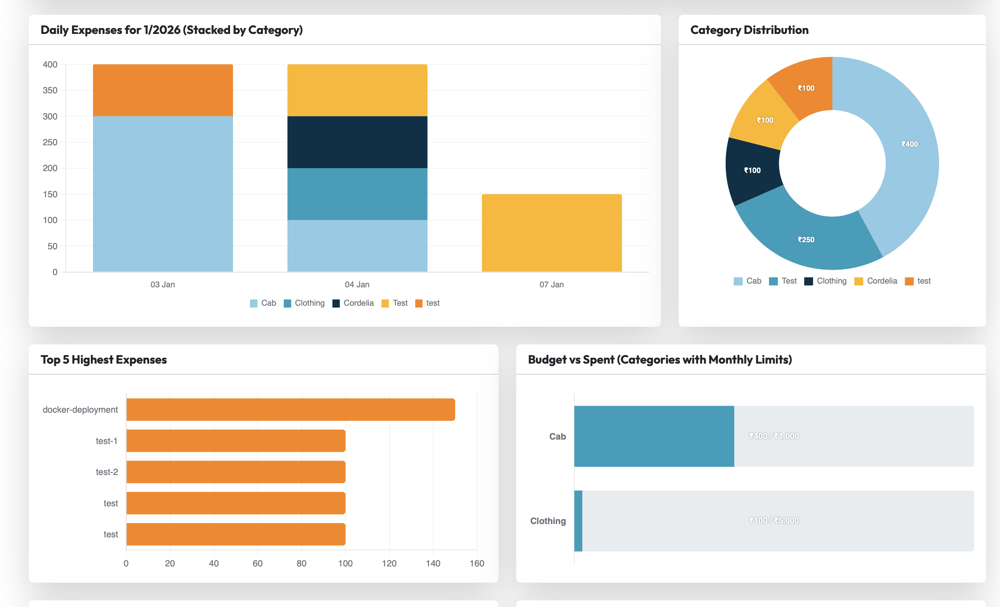
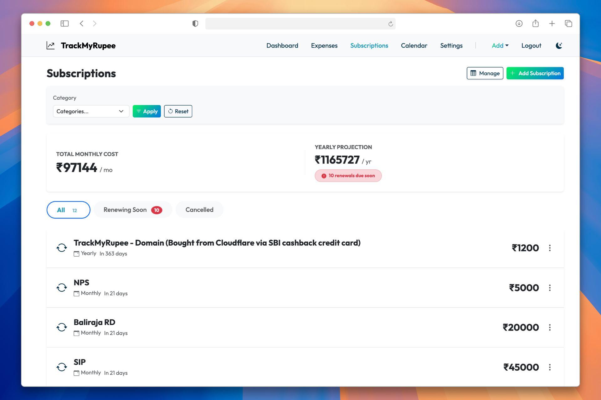
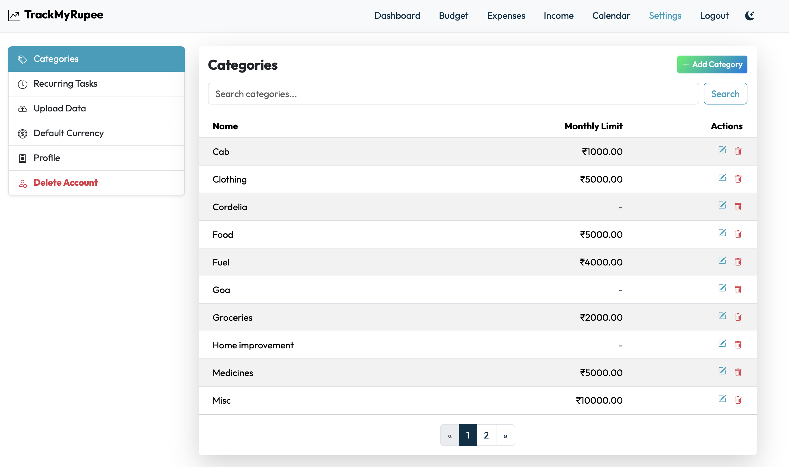

# Django Finance Tracker

A personal finance application to track expenses, analyze spending trends, and visualize data.

**🚀 Use the hosted version comfortably at [trackmyrupee.com](https://trackmyrupee.com)**

## Standout Features

### 1. Interactive Budget Dashboard
Visualize your monthly spending against your budget goals. Get instant alerts when you're nearing your limits.



### 2. Smart Excel Import
Bulk upload your expenses with intelligence. The system automatically enforces the selected year and handles various date formats.


### 3. Comprehensive Filtering
Slice and dice your financial data. Filter by **Year**, **Month**, **Category**, and **Date Range** to get the insights you need.


### 4. Recurring Transactions
Set it and forget it. Automate your regular income and expenses (like rent or subscriptions) so you never miss an entry.


### 5. Category Management & Limits
Create custom categories and set monthly spending limits. The dashboard visualizes your progress against these limits.


### 6. Multi-Currency Support
Work with your preferred currency. Update your profile settings to display your local currency symbol across the app.

### 7. Smart Category Prediction 🧠
Typing descriptions manually? Let the app do the work.
- **Personalized Learning**: Recognizes your custom habits (e.g., "Momos" → "Street Food") from your history.
- **Rule-Based Instant Match**: Instantly detects common terms like "Uber", "Netflix", "Zomato", etc.
- **Generative AI (Optional)**: Connect Google Gemini AI for advanced context-aware categorization.


## Prerequisites

-   Python 3.8+
-   pip (Python package manager)

## Installation

1.  **Clone the repository**:
    ```bash
    git clone <repository-url>
    cd django-finance-tracker
    ```

2.  **Create a virtual environment** (optional but recommended):
    ```bash
    python3 -m venv env
    source env/bin/activate  # On Windows use `env\Scripts\activate`
    ```

3.  **Install dependencies**:
    ```bash
    pip install -r requirements.txt
    ```

4.  **Apply database migrations**:
    ```bash
    python manage.py migrate
    ```
5.  **Setup Demo User** (Optional but recommended):
    ```bash
    python manage.py setup_demo_user
    ```

    **Note**: This command populates the database with sample data for the demo mode.
## Docker Setup

1.  **Clone the repository**:
    ```bash
    git clone <repository-url>
    cd django-finance-tracker
    ```

2.  **Create `.env` file**:
    Create a file named `.env` in the root directory. Fill in the values:
    ```env
    SECRET_KEY=''
    DEBUG=True
    EMAIL_HOST='smtp.gmail.com' # if you want to use gmail for sending emails
    EMAIL_PORT=587
    EMAIL_USE_TLS=True
    EMAIL_HOST_USER=''
    EMAIL_HOST_PASSWORD=''
    ```
    **Note**: The application will not run correctly without this file.

3.  **Run with Docker Compose**:
    ```bash
    docker-compose up --build
    ```
    **Note**: The container defaults to running migrations and setting up the demo user automatically on startup.

4.  **Access the application**:
    Open your browser and navigate to `http://localhost:8000`.


## Usage

### Running the Server

Start the development server:

```bash
python manage.py runserver
```

Open your browser and navigate to `http://127.0.0.1:8000/`.

### Getting Started

1.  **Sign Up**: Create a new account.
2.  **Add Expenses**: Manually add expenses or use the "Upload More" button.
3.  **View Dashboard**: authenticating will take you to the dashboard where you can filter and analyze your spending.

### Bulk Upload Format

To upload expenses via Excel, ensure your file follows this format:

-   **File Type**: `.xlsx`
-   **Sheets**: You can have multiple sheets (e.g., "Jan", "Feb").
-   **Columns**: The following columns are strictly required (headers are case-insensitive):
    -   `Date`: Supported formats: `DD MMM YYYY` (e.g., 01 Jan 2025), `YYYY-MM-DD`.
    -   `Amount`: Numeric value.
    -   `Description`: Text description.
    -   `Category`: Expense category (e.g., Food, Travel).

**Note**: When uploading, you will be asked to select a "Target Year". This year will override the year in the Excel dates to ensure data consistency.
