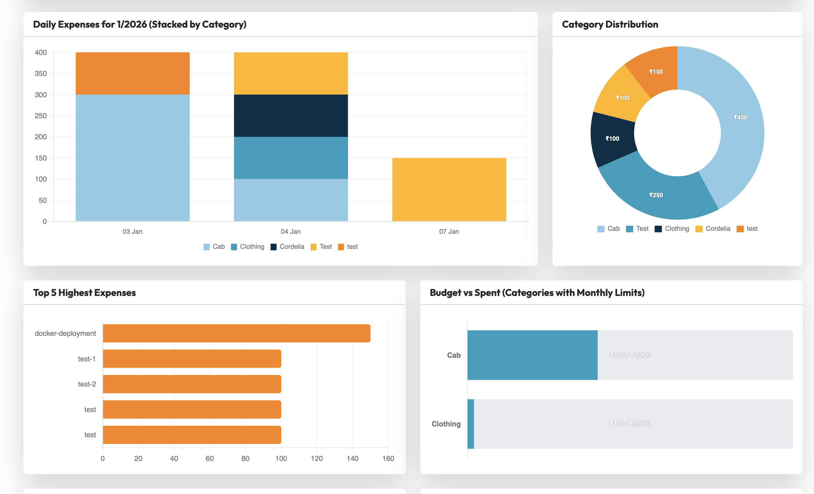

# TrackMyRupee
## Privacy-First Personal Finance Tracker & Expense Tracking App (No SMS, No Bank Access)

**TrackMyRupee** is a privacy-first personal finance tracker and expense tracking app built for people who want complete control over their money — without giving away their data.

Unlike most money management apps, TrackMyRupee does not read SMS, connect to bank accounts, or sell user data.
You manually track expenses, analyze spending, manage budgets, and stay in control — on your terms.

**Try Live App:** https://trackmyrupee.com  
**Star on GitHub:** https://github.com/OmkarPathak/django-finance-tracker

<div align="center">


</div>

---

## Why TrackMyRupee?

TrackMyRupee follows strict privacy principles:

-  ❌ No SMS reading
-  ❌ No bank account access
-  ❌ No selling or sharing financial data
-  ✅ Full data export and account deletion
-  Your money. Your data. Your control.

---

## Personal Finance Tracking Without Surveillance

Most expense tracking apps rely on:
- Reading SMS messages
- Connecting to bank accounts
- Sharing financial insights with third parties

**TrackMyRupee is different.**

It is a **privacy-first expense tracker** that gives you:
- Complete ownership of your financial data
- Manual and bulk expense tracking
- Transparent analytics with zero hidden tracking



---

## Features – Expense Tracking & Money Management

TrackMyRupee includes all the essential features expected from a modern **expense tracker and budget management app**:

✔ Daily expense tracking (manual entry)  
✔ Excel-based bulk expense import  
✔ Budget vs actual spending analysis  
✔ Visual dashboards and charts  
✔ Subscription and recurring payment tracking  
✔ Category-based expense filtering  
✔ Multi-currency support with real-time base currency conversion  
✔ Full multi-language support (English, Hindi, Marathi) including all settings pages  
✔ Automatic subscription tracking with currency normalization  
✔ Export your financial data anytime  

This makes TrackMyRupee ideal for:
- Individuals managing personal expenses
- Freelancers tracking income and costs
- Privacy-conscious users avoiding SMS-based apps

See [FEATURES.md] for detailed breakdown.

---

## Who Should Use TrackMyRupee?

TrackMyRupee is designed for:

- Users looking for a **simple expense tracker**
- People who want a **budget tracker without bank access**
- Anyone avoiding SMS-reading finance apps
- Developers looking for an **open source finance tracker**
- Users who want a **self-hosted personal finance app**

---

### Quick Start – Self-Hosted Expense Tracker (Docker)

Run your own self-hosted personal finance tracker in minutes:

```bash
git clone https://github.com/OmkarPathak/django-finance-tracker
cd django-finance-tracker
docker-compose up
```

Open: http://localhost:8000

### Manual Setup (Django)

```bash
pip install -r requirements.txt
python manage.py migrate
python manage.py createsuperuser
python manage.py runserver
```

---

Detailed steps can be found in `SETUP.md`

## Contributing to TrackMyRupee

TrackMyRupee is an open-source personal finance tracker.
Contributions are welcome — features, bug fixes, documentation, and UI improvements.

See `CONTRIBUTING.md`

---

## What users say

> “Finally a finance app that doesn’t read my SMS.”  
> — Early user

> “Simple, clean, and private.”  
> — Indie Hacker

---

## Roadmap

- [ ] **WhatsApp Integration** – Chat directly to add expenses 💬
- [ ] **Mobile Apps** – Native Android & iOS support 📱
- [ ] **Budget Alerts** – Smart insights and overspending notifications 🚨

---

## Recent Updates

- **Enhanced Multi-Currency Subscriptions**: Subscriptions now dynamically convert to your base currency, providing accurate monthly and yearly projections even when tracking foreign services (Netflix, AWS, etc.).
- **Full Settings Localization**: The entire settings interface, including Currency and Language preferences, is now fully translated into **Hindi** and **Marathi**.
- **Performance & Stability**: Refactored theme engine to eliminate flickering during page loads and standardized URL routing across all modules.
- **Improved Bulk Entry**: Smarter currency persistence when adding multiple records simultaneously.

---

## FAQ

**What makes this different from other finance apps?**  
TrackMyRupee doesn’t require bank linking or SMS reading — prioritizing user privacy.

**Can I self-host?**  
Yes — full Docker support and manual setup available.

**Is there a mobile app?**  
Android & iOS builds are coming soon.

---

## License

TrackMyRupee is licensed under the MIT License.
